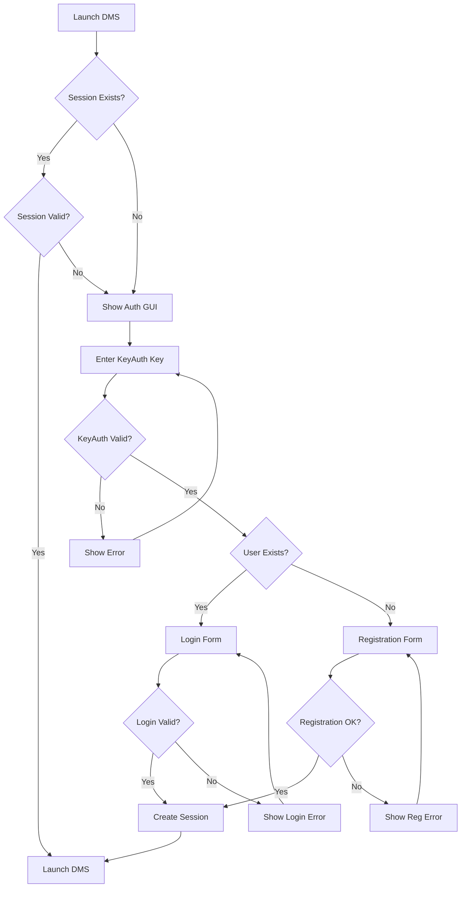

# DMS KeyAuth Integration - Quick Start Guide

## 🎉 Integration Complete!

The DMS project has been successfully integrated with KeyAuth authentication, following the same pattern used in the NeuralAim project. Users now must verify their KeyAuth license and create local accounts before accessing DMS features.

## 🚀 Quick Start

### For Users

1. **Launch DMS (now with integrated authentication):**
   ```bash
   # Windows
   launch.bat
   
   # Linux/Mac
   ./launch.sh
   ```

2. **First-time setup:**
   - Enter your KeyAuth license key
   - Wait for verification
   - Create a username and password
   - Access DMS features

3. **Subsequent launches:**
   - Your session will be remembered
   - Just launch and go!

### For Developers

```bash
# Manual launch
python unified_launcher.py

# Test the system
python test_auth.py

# Install dependencies only
pip install -r requirements/requirements_auth.txt
```

## 📋 What Was Implemented

✅ **KeyAuth License Verification**
- Adapted KeyAuth API from NeuralAim
- Hardware ID binding
- License expiry checking
- Encrypted server communication

✅ **User Registration & Login**
- Local SQLite database storage
- Secure password hashing (PBKDF2 + salt)
- Session management with tokens
- Automatic session persistence

✅ **Modern Authentication GUI**
- Cross-platform Qt interface (PyQt5/6/PySide6)
- Dark theme with professional styling
- Step-by-step authentication flow
- Real-time verification feedback

✅ **Secure Session Management**
- 24-hour session duration (configurable)
- Automatic session cleanup
- Session restoration on app restart
- Secure token generation

✅ **Complete Integration**
- Authenticated launcher as main entry point
- Fallback mode for non-authenticated access
- Configuration management
- Comprehensive error handling

## 🔧 Configuration

KeyAuth settings in `config/keyauth_config.json`:
```json
{
    "application": {
        "name": "DMS - Detection Model Suite",
        "ownerid": "JR8hfS3d4v",
        "secret": "d7c57798279632a99a4429bc07ece9bf6070d5d2229c1d03387c7bc6d0b94c10",
        "version": "1.0.0"
    }
}
```

## 📁 File Structure

```
DMS/
├── unified_launcher.py           # 🚀 Unified launcher with KeyAuth
├── launch.bat                    # 🪟 Windows launcher
├── launch.sh                     # 🐧 Linux/Mac launcher
├── test_auth.py                  # 🧪 Test script
├── src/auth/                     # 🔒 Authentication system
│   ├── keyauth_api.py           # KeyAuth API integration
│   ├── user_manager.py          # Database & user management
│   ├── auth_manager.py          # Authentication flow coordinator
│   └── auth_gui.py              # Modern GUI interface
├── config/keyauth_config.json   # ⚙️ KeyAuth configuration
├── requirements/requirements_auth.txt # 📦 Dependencies
└── docs/AUTHENTICATION_GUIDE.md # 📚 Detailed documentation
```

## 🔒 Security Features

- **KeyAuth Integration**: Same secure system as NeuralAim
- **Password Security**: PBKDF2 hashing with 100,000 iterations
- **Session Security**: Cryptographically secure tokens
- **Hardware Binding**: License tied to hardware ID
- **Encrypted Storage**: All sensitive data properly encrypted

## 🛠️ Dependencies

Required packages (auto-installed):
- `PyQt5` - GUI framework
- `pycryptodome` - Cryptography
- `requests` - HTTP communication
- `wmi` - Hardware information (Windows)

## 🐛 Troubleshooting

### Common Issues

1. **"Authentication system not available"**
   ```bash
   pip install PyQt5 pycryptodome requests wmi
   ```

2. **"License verification failed"**
   - Check your KeyAuth license key
   - Verify internet connection
   - Ensure license hasn't expired

3. **GUI not loading**
   - Try: `pip install PyQt6` or `pip install PySide6`
   - Check console for specific errors

4. **Session issues**
   - Delete `data/current_session.json`
   - Restart the application

### Test the System
```bash
python test_auth.py
```

## 🔄 Workflow Implemented



## 🎯 Next Steps

The authentication system is now fully integrated and ready for use. Users can:

1. **Launch DMS** using the new authenticated launcher
2. **Verify their KeyAuth license** on first run
3. **Create local accounts** for ongoing access
4. **Enjoy seamless authentication** with session persistence

For detailed documentation, see `docs/AUTHENTICATION_GUIDE.md`.

---

**🔐 DMS is now secured with KeyAuth authentication!** 🎉 